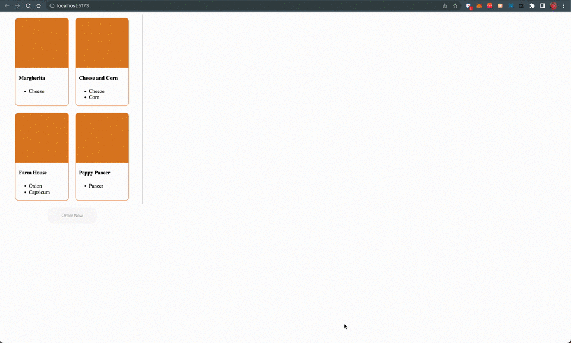

# Pizza Management System

To install and run it locally

Server setup

- Copy .env.example to .env
- NOTE: MONGO_URI is required to put into .env

```
cd server
npm install
npm run dev
```

Client setup
```
cd client
npm install
npm run dev
```

Demo



